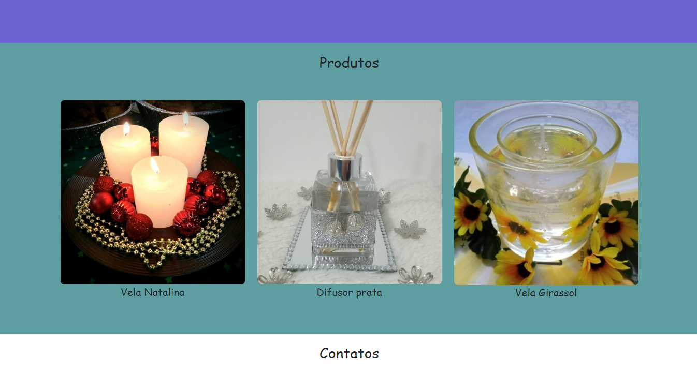
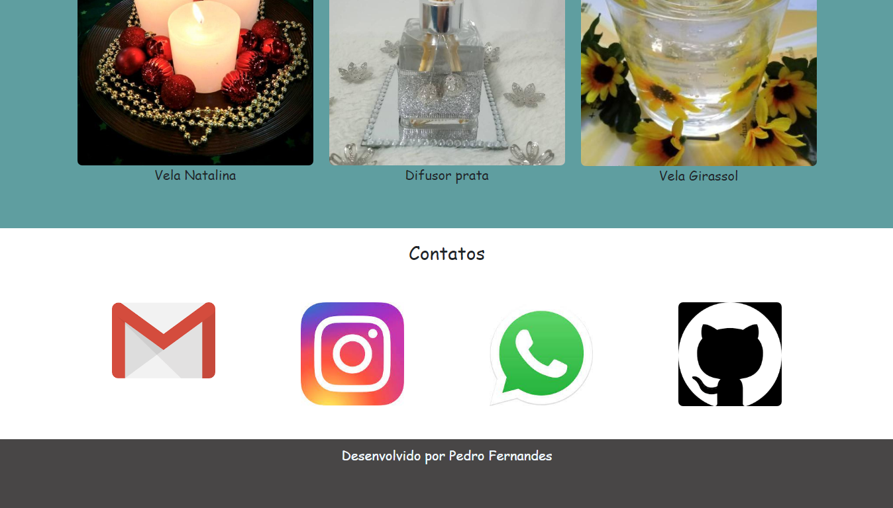

# Projeto_PPI2

## Sobre o autor

Me chamo Pedro Henrique Fernandes de Santana, tenho 22 anos e estou no 5º semestre do curso de Tecnologia em Sistemas para Internet do Instituto Federal de Brasília - IFB.

## O que o projeto faz

O projeto é o desenvolvimento de um sistema para a divulgação da empresa Casa com Cheiro e seus produtos.

## Objetivos do projeto:
Esse projeto visa 4 tópicos, a seguir:
 - Desenvolver sistemas web utilizando frameworks modernos.
 - Relacionar técnicas de desenvolvimento web e de comercio eletônico;
 - Implementar APIs para aplicações web;
 - Implantar sistemas web.
 
## Por que o projeto é útil

O projeto vai ajudar o estudante a desenvolver as habilidades necessárias para o mercado de trabalho na área de programação web e comércio eletrônico.

## Seções do Projeto

#### Seção Menu e Quem somos

A tela apresenta um menu e um texto sobre a empresa.

#### Seção de Produtos

Tela apresenta alguns produtos que a empresa vende.

#### Seção de Contatos

Essa tela mostra links dos contatos da empresa e o endereço do repositório onde o projeto se encontra. Bem como o linkedin do desenvolvedor do projeto.

## Quem mantém e contribui com o projeto

O projeto será mantido e terá a contribuição,a princípio, somente do autor principal, o estudante Pedro Henrique.
